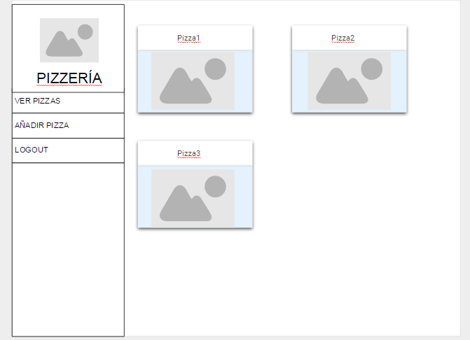
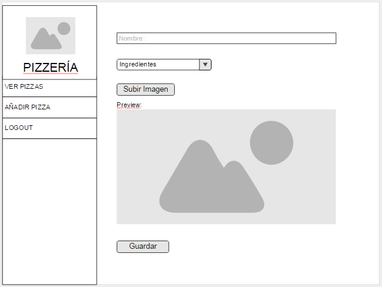
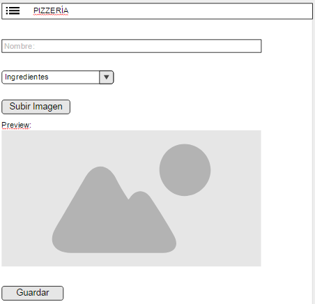

# Hi Quim, Daniel, Yannay, Guille!! 

### Development environment installation
  - .Net Core SDK: 
    > https://dotnet.microsoft.com/download
  - Visual Studio Code 2010 with C# and Java plugin
    > https://visualstudio.microsoft.com/es/downloads
    <https://marketplace.visualstudio.com/items?itemName=vscjava.vscode-java-pack>
    https://marketplace.visualstudio.com/items?itemName=ms-vscode.csharp
  - Install Entity Framework by the following steps:
	> https://docs.microsoft.com/es-es/ef/core/get-started/install/
### The project
For run the project
```sh
dotnet run
```


***
***


**Práctica Fase 2: 200 hs. de avanzado en Frontend**

El objetivo de la prueba consiste en realizar una aplicación para pizzerías que ofrece la siguiente funcionalidad:

- --Mostrar todas las pizzas disponibles.
- --Ver la información de una pizza en concreto.
- --Añadir comentarios a una pizza.
- --Crear una pizza introduciendo su nombre, los ingredientes y una imagen.

Los usuarios deben poder registrarse en la aplicación por medio de un formulario de registro y ♦♦hacer log-in.

**Entidades:**

- -- **Pizza:** nombre, foto, ingredientes (no requerido), comentarios (no requerido) y precio. El precio se calcula de la siguiente forma:

Precio = SUM(Precio\_Ingrediente) + 5€

- -- **Ingrediente:** nombre y precio.
- -- **Comentario:** texto, puntuación, fecha, usuario y pizza.
- -- **Usuario:** email, nombre, apellidos y contraseña.

Todos los campos son requeridos excepto los ingredientes de una pizza (margarita) y sus comentarios.

**Escena:**

Al tratarse de una SPA la aplicación constará de una sola ventana y tres vistas, una para hacer log-in, una para registrarse y la de la pizzería. El diseño del log-in y el registro queda como ejercicio.

En cuanto a la vista de las pizzas, a la izquierda debe aparecer un menú con el logo y el nombre de la aplicación y las siguientes opciones: ver pizzas, añadir pizza y logout.

Este menú debe ocultarse en dispositivos de menor tamaño y ser sustituido por una barra de aplicación que contiene un botón que al ser pulsado muestra el menú. Cuando se selecciona cualquiera de las opciones del menú éste debe ocultarse otra vez.

**Vistas:**

En el espacio restante de la ventana han de aparecer los siguientes elementos en función de la ruta:

- -- **/pizzas** : una card por cada pizza que contenga su imagen y nombre, al  pulsar en dicha card se ha de mostrar la información de la pizza seleccionada.
- -- **/pizzas/:id** : muestra la información de una pizza en concreto, aparecen su imagen y nombre y a la derecha una lista con sus ingredientes (nombre y precio). Debajo aparece el formulario para añadir un comentario con los campos puntuación (entre 0 y 10) y texto. Debajo de este formulario aparecen todos los comentarios de la pizza mostrando el usuario, la fecha, la puntuación y el texto.
- -- **/pizzas/add** : formulario para añadir una pizza. Requiere nombre, ingredientes (a seleccionar de los ingredientes existentes) y una imagen de la pizza. La imagen seleccionada debe poder visualizarse.

Como referencia se pueden emplear los siguientes mockups:

**Ver Pizzas:**

 

**Pizza:**

 

**Añadir pizza:**

 

**Barra de aplicación:**

 

**Requisitos funcionales:**

A parte de ofrecer la funcionalidad descrita anteriormente, la aplicación…

- --Debe haber autentificación con Redes sociales y log-in propio, Oauth y JWT.
- --Debe permitir CORS.
- --El diseño ha de ser responsive.
- --La aplicación debe redirigir a la pantalla de log-in si el usuario no está autenticado.
- --Si el usuario está autenticado, por defecto se mostrará la lista de pizzas.
- --Los formularios deben contar con mensajes de error representativos para el usuario

- -- 
